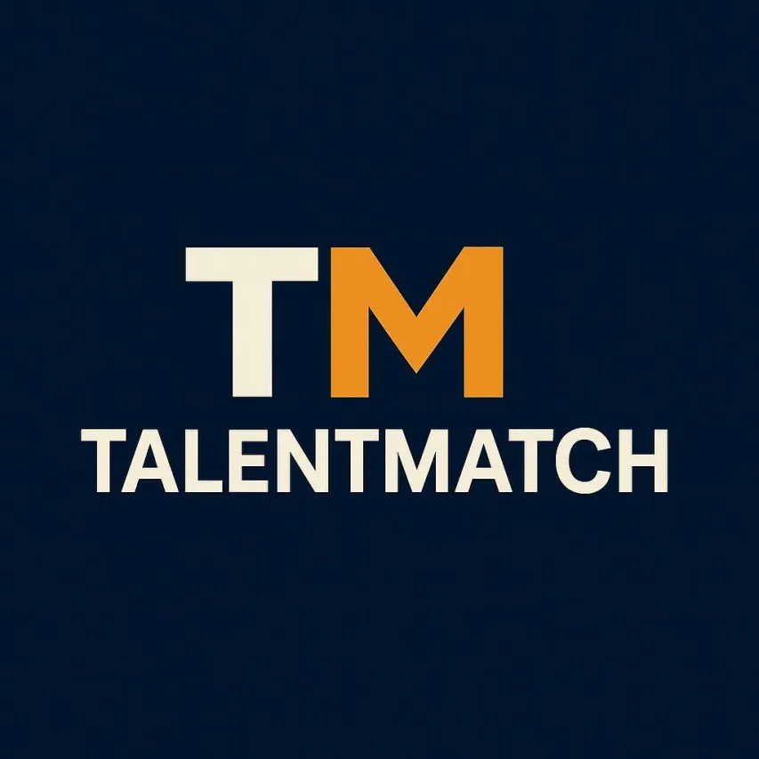

🔍Bienvenido a Talent Match

Optimizando la búsqueda y selección de talento para reclutadores

📋 Tabla de Contenidos
Descripción
Características Principales
Tecnologías Utilizadas
Demostración
Instalación y Uso
Estructura del Proyecto
Contribución
Contacto

🚀 Descripción
Talent Match es una aplicación web innovadora desarrollada con React que revoluciona la gestión de búsqueda y selección de talentos para reclutadores. Nuestra plataforma ofrece una interfaz intuitiva y herramientas poderosas para identificar, evaluar y conectar con los mejores candidatos de manera eficiente.
✨ Características Principales

Características detalladas:

  
📊 <b>Dashboard Intuitivo</b>

Visualización clara de métricas claves como candidatos activos, entrevistas programadas y ofertas enviadas. Gráficos interactivos para análisis de datos en tiempo real.

  
🔄 <b>Gestión de Procesos</b>

Seguimiento del estado de cada candidato a través de un sistema personalizable con etapas de reclutamiento definidas.

  
🯠<b>Facilidad de Uso</b>

Diseño intuitivo que permite a usuarios de todos los niveles técnicos aprovechar al máximo la plataforma sin necesidad de capacitación extensa.

🛠️ Tecnologías Utilizadas

| Tecnología | Descripción |
|------------|-------------|
| React | Librería principal para la construcción de interfaces de usuario |
| Tailwind CSS | Framework de CSS para estilos rápidos y responsivos |
| Firebase | Plataforma para autenticación y base de datos |
React Router DOM | Navegación entre páginas de la aplicación |
React Icons & Lucide React | Bibliotecas de íconos para mejorar la UI |
Axios | HTTP para consumo de APIs |
Firebase | Plataforma para autenticación y base de datos |
React Data Table | Componente para visualización de datos en tablas |
Vite | Empaquetador y servidor de desarrollo ultrarrápido | 
ESLint | Herramienta para mantener código limpio y uniforme |

🖥️ Demostración

 
Ver Demo en Vivo: https://sp-equipo12.netlify.app/

📂 Estructura del Proyecto
talent match/
├── public/
│   ├── assets/
│   └── favicon.ico
├── src/
│   ├── components/
│   ├── context/
│   ├── hooks/
│   ├── pages/
│   ├── services/
│   ├── styles/
│   ├── utils/
│   ├── App.jsx
│   └── main.jsx
├── .eslintrc.json
├── .gitignore
├── index.html
├── package.json
├── README.md
├── tailwind.config.js
└── vite.config.js

 
👥 <b>Facilidad de Uso</b>

Haz un Fork del proyecto
Crea una rama para tu funcionalidad (git checkout -b feature/amazing-feature)
Realiza tus cambios y haz commit (git commit -m 'Add some amazing feature')
Sube tus cambios (git push origin feature/amazing-feature)
Abre un Pull Request

📬 Contacto
Equipo Talent Match - talent.match.group@gmail.com
Linkedin: https://www.linkedin.com/company/thetalentmatch/

Link del Proyecto: https://github.com/Yappur/Equipo12-SmartProject

Desarrollado con ❤️ por Equipo 12
<a href="#-talent-match">⬆️ Volver arriba ⬆️</a>

